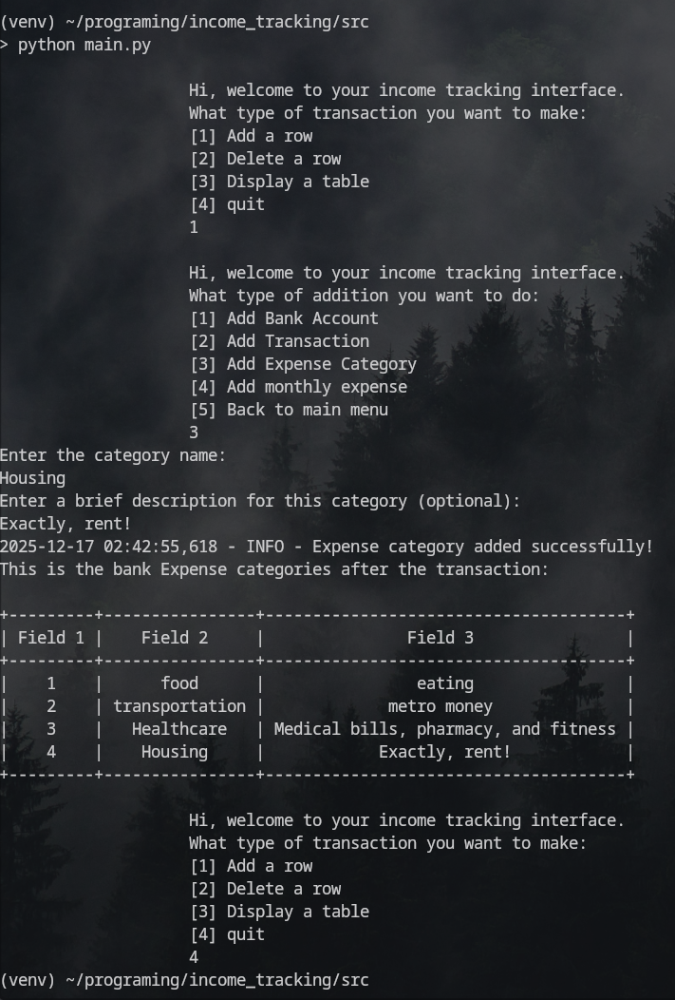

# Income Tracker (PostgreSQL Learning Project)

This project is a simple command-line application built to practice **PostgreSQL** and **Python database interactions** using `psycopg2`. It models a basic personal income and expense tracking system.


## Project Goals
* Record incoming and outgoing transactions
* Categorize expenses to see what they spend money on every month
* Get a clearer picture of cash flow and spending habits
* Organize and priorities their monthly expenses

## Project Overview:




## Database Schema

The database tracks bank accounts, transactions, expense categories, and monthly expenses.<br>


## Project Structure

```
src/
│
├── cli.py                  # CLI menus and user input
├── connection.py           # PostgreSQL connection handling
├── db_operations.py        # CRUD operations
├── user_input.py           # Main program loop
│
├── database.ini            # Database credentials
│
├── sql/
│   ├── 01_create_tables.sql
│   ├── 02_insert_data.sql
│   └── 03_test_query.sql
```

---

## Setup Instructions

### 1. Create the Database

```sql
CREATE DATABASE incomeDB;
```

### 2. Configure Database Connection

Edit `database.ini`:

```ini
[postgresql]
host=localhost
database=incomeDB
user=your_user
password=your_password
port=5432
```

---

## Running the Application

From the `src` directory:

```bash
python main.py
```

You will interact with a CLI menu that allows you to:

* Add records
* Delete records
* Display tables

---

## Features

* Add bank accounts
* Record transactions
* Define expense categories
* Track fixed monthly expenses
* Delete records by ID
* Display database tables in terminal

---

## Future Improvements (Optional)

* Update operations
* Replace manual CLI inputs with interactive forms and buttons
* Better input validation
* Logging to file
* Docker setup

---

## License
1. Indeed, the Readme is AI made (under sever instructions) but the code is human written.<br>
2. This project is for learning purposes only.

